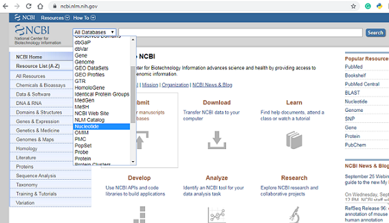
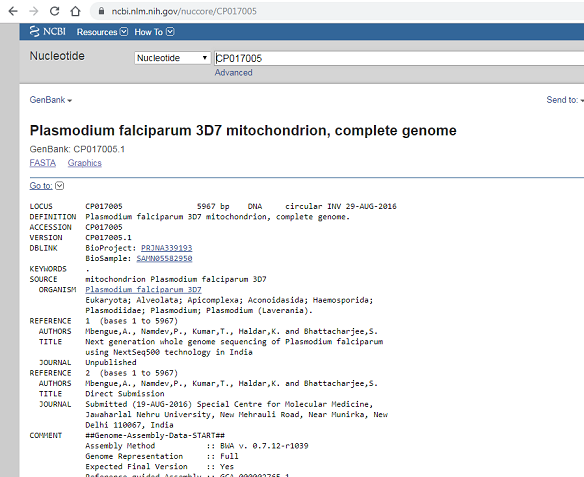
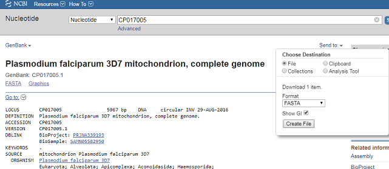
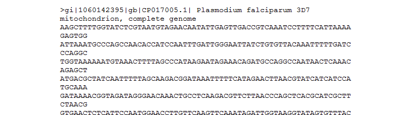

### Welcome to my page! I am really interested in mosquito's and the diseases they transmit. In my personal case it would be malaria which is transmitted by the anopheles mosquito, the definitive host of the plasmodium falciparum parasite. So lets take a peak at the genome of this unicellular protozoan parasite!

I am going to use the programming language R to do some basic statistcal analysis and then switch to python to do some more advanced stuff like amino acid compostion etc.So lets delve right into it. Instructions for downloading R can be located in my R install folder. We would also need to install Bioconductor. Instruction that also can be located in the bioconductor folder. Now we need to get our hands on some data! Fortunatel,y we have tons of that to analyze from various databases within the NCBI web portal.

We begin the data acquisition process by going to the NCBI website .Once we get to the site locate the "all database" drop down menu to the left of the screen, click on the drop down menu, scroll down and select nucleotide.The Nucleotide database is a collection of sequences from several sources, including GenBank, RefSeq, TPA and PDB. Genome, gene and transcript sequence data provide the foundation for biomedical research and discovery.

For this mini project i would be analyzing the Plasmodium falciparum 3D7 mitochondrion, complete genome (PF3D7). To retrieve our data we would use the NCBI accession ID (CP017005) for PF3D7. Type CP017005 in the Search box at the top of the webpage, and press the “Search” button beside the Search box. This should bring up general information and meta data of the PF3D7 genome.

To retrieve the DNA sequence for the PF3D7 genome as a FASTA format sequence file,
click on “Send” at the top right of the CP017005 sequence record webpage, and then choose “File” in the pop-up
menu that appears, and then choose FASTA from the “Format” menu that appears, and click on “Create file”.
A box will pop up asking you what to name the file, and where to save it. You should give it a sensible name (eg.
“PF3D7.fasta”) and save it in a place where you will remember (eg. in the “My Documents” folder is a good idea):

We can now open the FASTA file containing the PF3D7 genome sequence using WordPad on your
computer. To open WordPad, click on “Start” on the bottom left of your screen, click on “All Programs” in the
menu that appears, and then select “Accessories” from the menu that appears next, and then select “WordPad”
from the menu that appears next. WordPad should start up. In Wordpad, choose “Open” from the “File” menu.
The WordPad “Open” dialog will appear. Set “Files of type” to “All Documents” at the bottom of the WordPad
“Open” dialog. You should see a list of files, now select the file that contains the PF3D7 sequence. The contents of the FASTA format file containing the PF3D7 sequence should now be displayed in WordPad:

Now we have some data to work with! We are going to conduct a few exercises in R with the data we now have available. In the following order; 
1.Read our sequence data into R
2.Sequence length
3.Base composition
4.GC content
5.Scatter Plot of GC Content using a sliding window of 300 nucleotides

